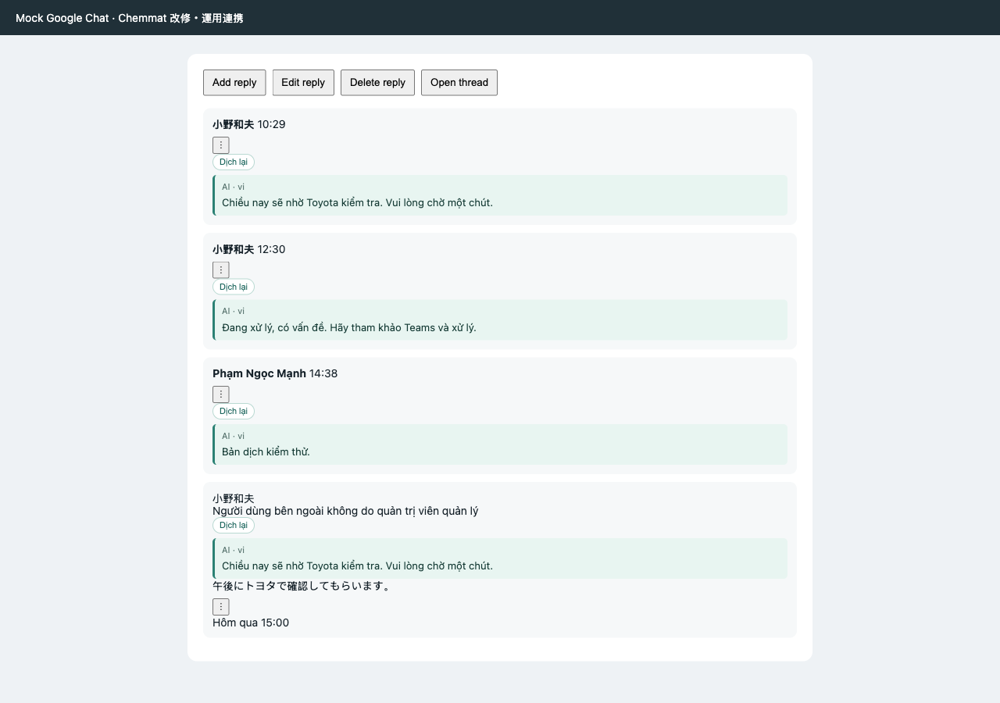
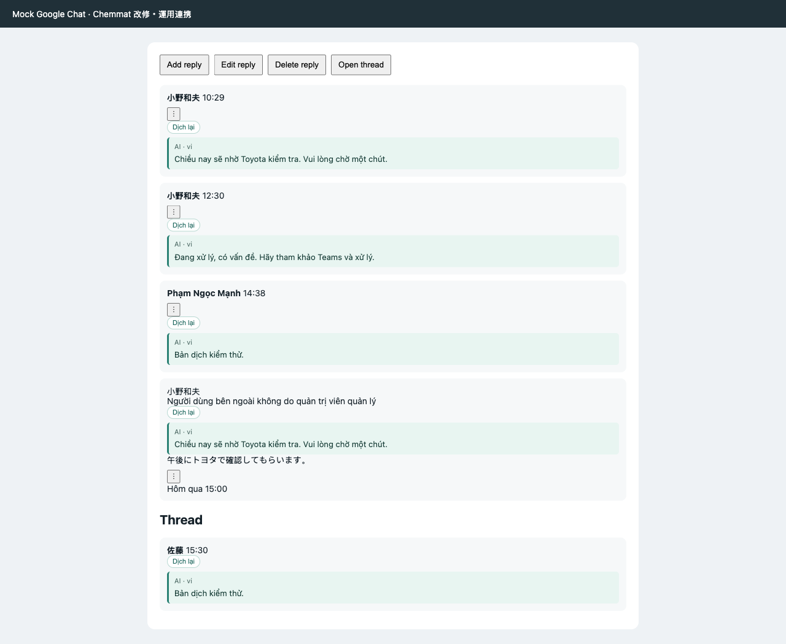
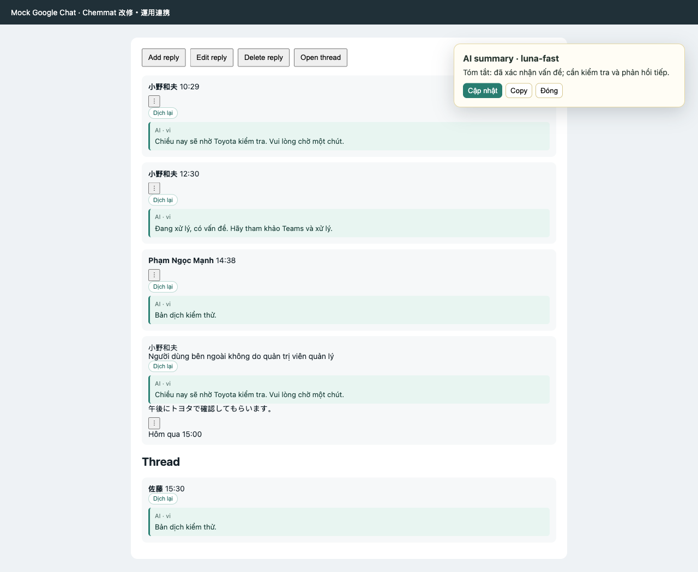
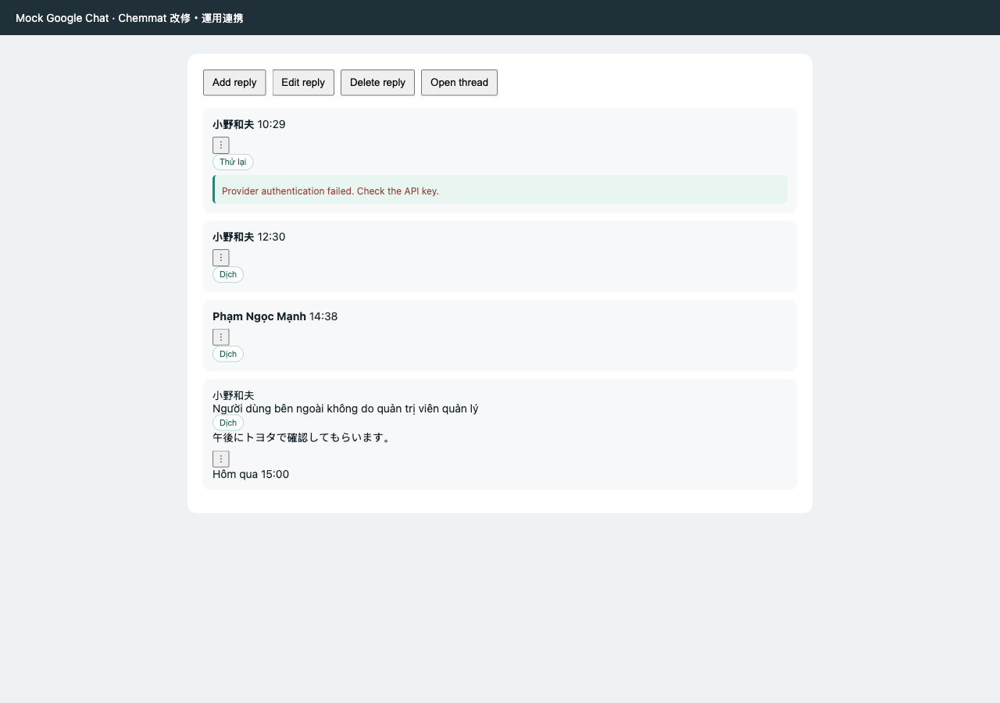

# TranslateChat AI

Tiện ích Chrome MV3 giúp dịch message trong Google Chat và tạo bản tóm tắt AI riêng tư cho thread.

## Chức năng

- Dịch nội dung chính của message sang ngôn ngữ được chọn, mặc định là tiếng Việt; tự động bỏ qua phần message được trích dẫn.
- Tự động dịch message mới khi bật `Tự dịch message mới`.
- Hoạt động ở room chính và thread con đang mở.
- Thêm nút `Tóm tắt thread bằng AI` vào menu ba chấm của message.
- Dùng provider tương thích OpenAI, ví dụ 9router chạy local.
- Cache bản dịch và summary ở local để không gọi provider lại khi không cần.
- Che password, bearer token và API key trước khi gửi nội dung tới provider.

## Cài extension dạng unpacked

1. Mở `chrome://extensions` trong Chrome.
2. Bật **Developer mode**.
3. Chọn **Load unpacked** và chọn thư mục project này.
4. Mở Google Chat. Khi source thay đổi, bấm Reload extension tại `chrome://extensions`.
5. Hard-refresh tab Google Chat.

Extension chỉ chạy trên `chat.google.com` và URL fixture local dùng cho test.

## Cấu hình provider

1. Bấm icon extension rồi chọn **Mở Settings**, hoặc mở trang Options của extension.
2. Nhập **Base URL** của endpoint tương thích OpenAI, ví dụ `http://127.0.0.1:<port>/v1`.
3. Nhập API key của provider. Key được lưu trong `chrome.storage.local`, không lưu trong Chrome Sync.
4. Chọn model. Các model có tên chứa `luna` được ưu tiên đứng đầu; có thể chọn `gpt-5.6-luna` hoặc nhập đúng model ID provider cung cấp.
5. Chọn ngôn ngữ đích, ngôn ngữ nguồn, timeout, thời gian cache và chế độ che credential.
6. Bấm **Lưu Settings**.

Extension không gọi Google Translate. Cả dịch và tóm tắt đều dùng AI provider đã cấu hình.

## Bật từng room cần dịch

Mặc định extension không dịch room nào cho tới khi bạn bật rõ ràng.

1. Mở room cần dịch trong Google Chat.
2. Bấm icon extension.
3. Bật **Dịch room này**.
4. Giữ tắt đối với room không muốn xử lý.

Danh sách room được bật được lưu local cùng Settings. Tắt công tắc **Dịch tự động** sẽ dừng xử lý message mới nhưng không xóa cấu hình.

## Dịch message

- Khi bật dịch tự động, nút `Dịch` và vùng bản dịch xuất hiện bên dưới nội dung message.
- Message gốc vẫn được giữ nguyên. Bản dịch dài sẽ tự xuống dòng trong khung message.
- Phần nội dung được trích dẫn vẫn hiển thị nguyên bản và không được gửi lên provider; chỉ phần message mới được dịch.
- Mở thread con: các reply trong panel thread chi tiết sẽ được tự động quan sát và dịch.
- Bấm `Dịch lại` để thử lại bản dịch bị lỗi hoặc bản dịch của nội dung đã thay đổi.
- Lỗi provider chỉ hiển thị thông báo an toàn trong UI extension; nội dung gốc trong Google Chat không bị thay thế.





## Tóm tắt thread

1. Mở menu ba chấm của message.
2. Bấm **Tóm tắt thread bằng AI**.
3. Đọc summary trong popup riêng tư của extension.
4. Khi có message mới, popup hiển thị thông báo cần cập nhật.
5. Bấm **Cập nhật** để tóm tắt lại phần thay đổi. Summary không bao giờ được gửi thành message vào Google Chat.



## Cache và quyền riêng tư

- Cache dịch và cache summary dùng hai namespace local riêng biệt.
- Kết quả thành công được dùng lại cho tới khi hết TTL đã cấu hình.
- Kết quả provider bị lỗi không được cache.
- **Xóa cache dịch** và **Xóa cache summary** chỉ xóa đúng loại cache tương ứng.
- Kết quả từ provider được render như text, nên HTML-like output không thể thực thi.
- Không đưa API key production, dữ liệu room riêng tư hoặc screenshot message thật vào repository.

## Xử lý sự cố

| Hiện tượng | Cần kiểm tra |
|---|---|
| Không thấy bản dịch | Kiểm tra room đã bật, công tắc dịch tự động đang bật và model provider đã cấu hình. |
| Lỗi authentication | Nhập lại API key trong Settings. |
| Lỗi rate limit hoặc server | Bấm `Dịch lại` hoặc `Cập nhật` sau khi provider hoạt động; extension không tự retry ngầm. |
| Request timeout | Tăng timeout trong Settings hoặc kiểm tra process provider local. |
| Thread con không được dịch | Reload extension, hard-refresh Google Chat, bật room hiện tại rồi mở lại thread con. |
| Bản dịch cũ còn hiển thị sau khi sửa message | Bấm `Dịch lại`; nội dung mới sẽ dùng cache key mới. |



## Phát triển và chạy test

Cài dependency một lần:

```bash
npm install
```

Chạy unit test:

```bash
npm run test:unit
```

Chạy E2E test với fixture Google Chat và provider local deterministic:

```bash
npm run test:e2e
```

Chạy toàn bộ test:

```bash
npm test
```

Tạo lại screenshot cho README:

```bash
node scripts/capture-readme-screenshots.mjs
```

Automated test không dùng Google Chat production, 9router production, API key thật hoặc nội dung room live.
